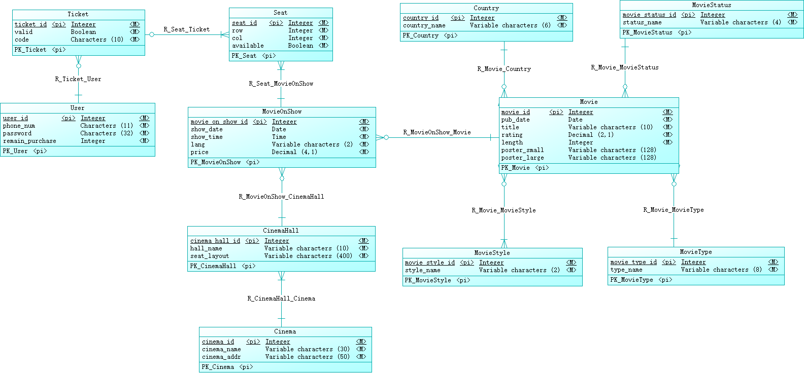
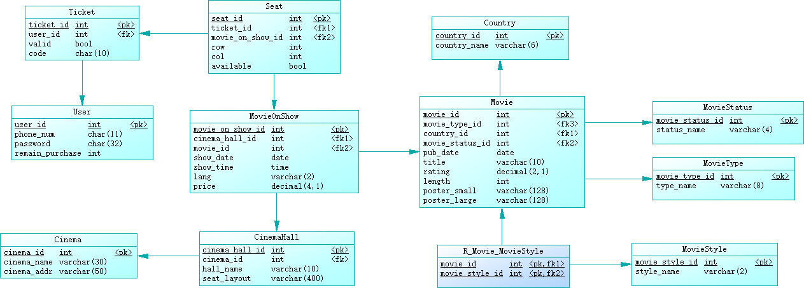

# Database

Data model and initialization scripts of AwesomeTickets database.

[Dashboard](https://github.com/AwesomeTickets/Dashboard)

## Initialize database

```
$ pip3 install PyMySQL
$ python3 init_db.py
```

## Conceptual data model



## Physical data model



## Credits

- PowerDesigner 16.5.0

## License

See the [LICENSE](./LICENSE) file for license rights and limitations.